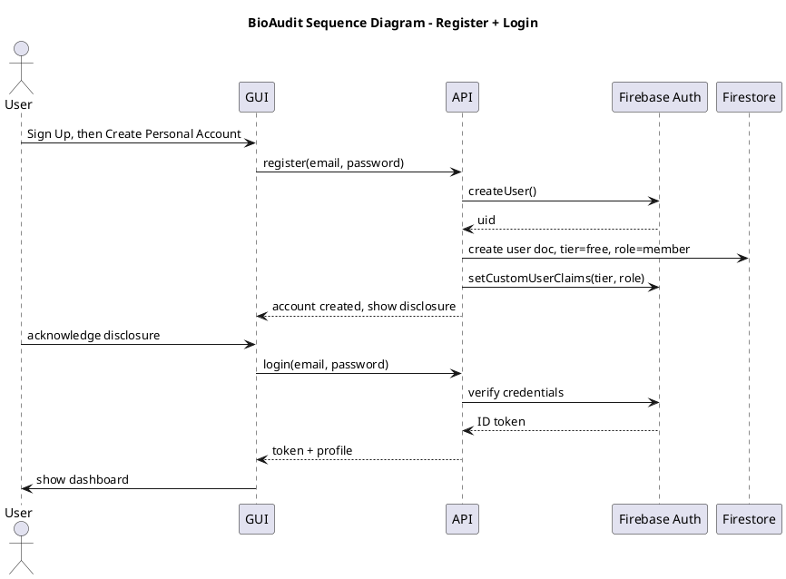
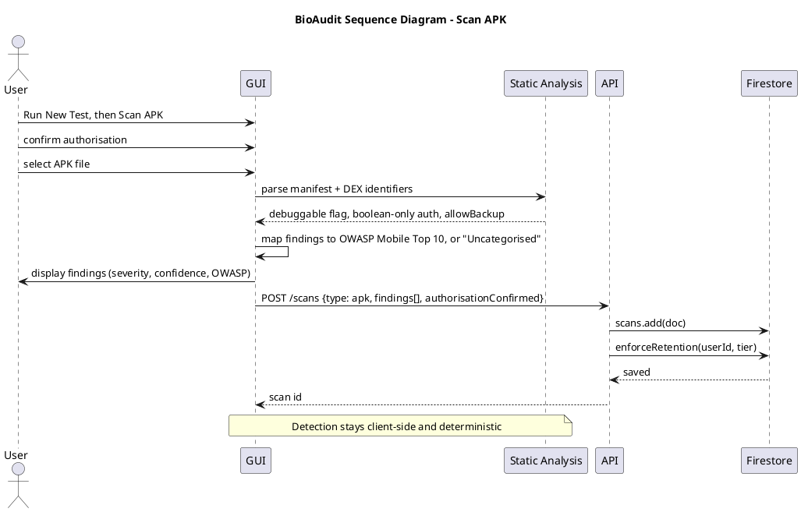
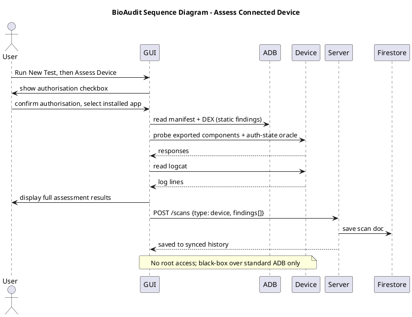
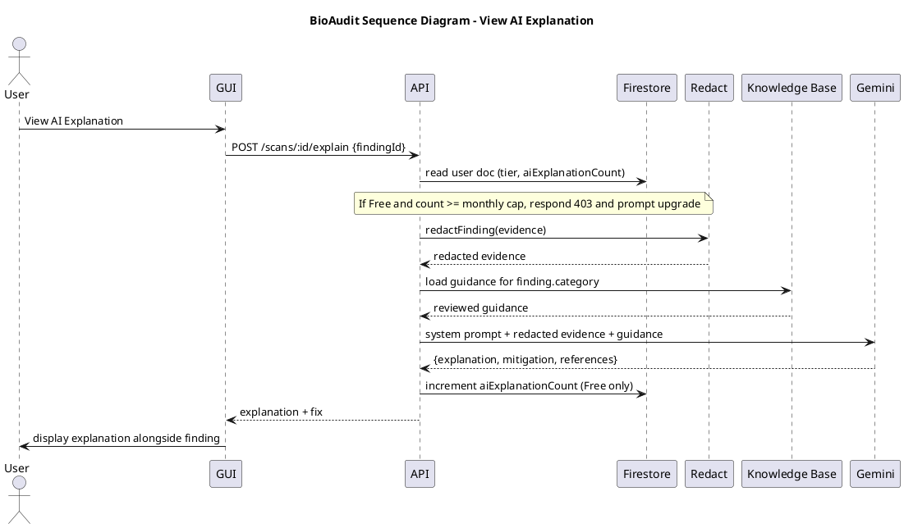
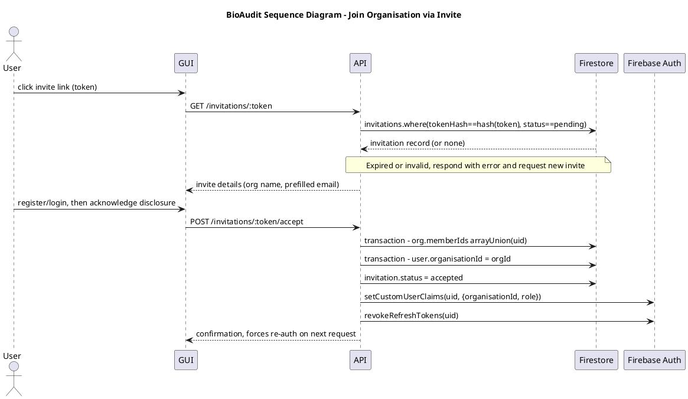
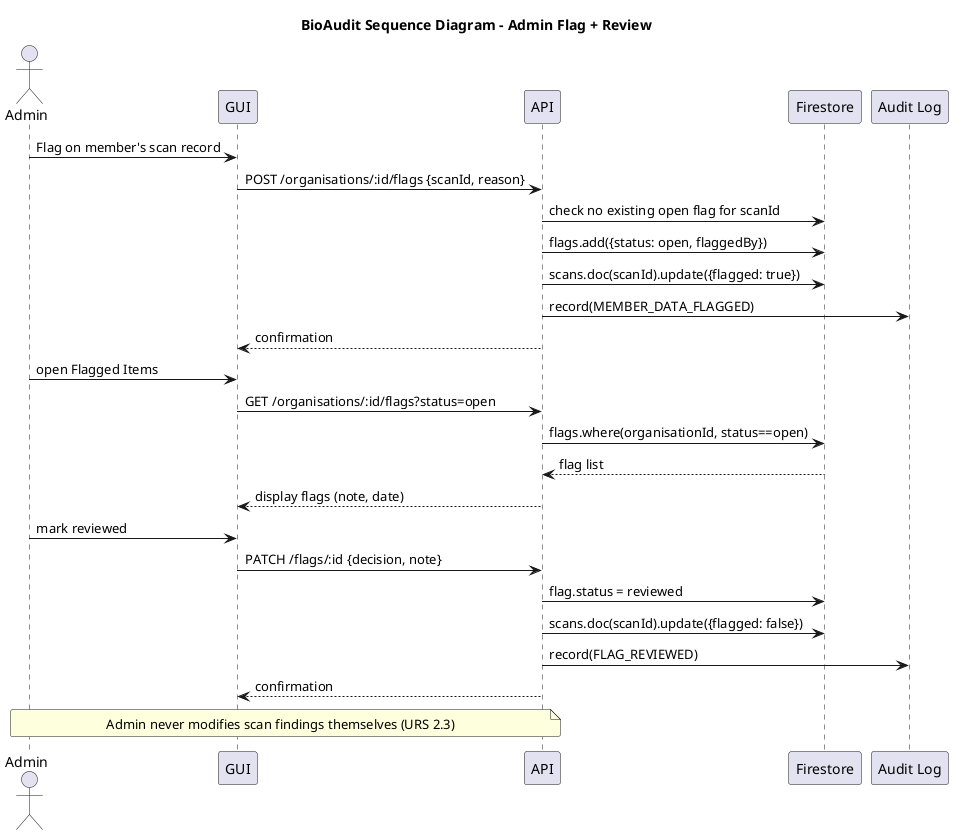
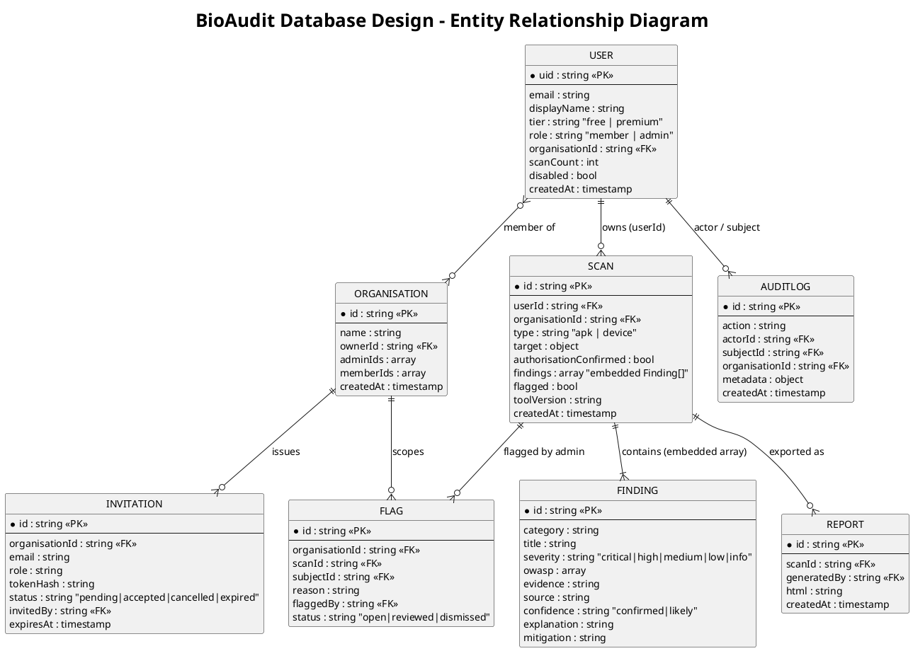

# BioAudit — Sequence Diagrams (PlantUML)

Same six flows as `TDM-sequence-diagrams-text.md`, converted to PlantUML syntax. Solid
arrow (`->`) = call/request/instruction; dashed arrow (`-->`) = the return value/response
for that call, drawn sender-to-receiver (PlantUML convention, not reversed). Paste any
block between `@startuml`/`@enduml` into plantuml.com/plantuml or a local renderer.

Each diagram carries a `skinparam` block approximating the requested draw.io lifeline
style (`shape=umlLifeline`, rounded, `#181818` stroke, black 14pt font) as closely as
PlantUML's styling model allows — PlantUML has no raw mxGraph shape/style import, so
this is a visual approximation via `skinparam`, not a literal translation of that string.

Section 7 at the bottom adds the database design (entity relationship diagram) in the
same PlantUML/styling convention, so this file covers both process and data views.

## 1. Register + Login (UR01 / US01)

## 2. Scan APK (US09)

## 3. Assess Connected Device (US10)

## 4. View AI Explanation with tier cap (FR01 / PR01)

## 5. Join Organisation via Invite (UR02 / US08)

## 6. Admin Flag + Review (AD13 / AD14)

## 7. Database Design (Entity Relationship Diagram)

Grounded in `backend/src/constants/index.js` (`COLLECTIONS`) and the service files
(`users.service.js`, `scans.service.js`, `organisations.service.js`) — same source as
the Mermaid ERD in `TDM-technical-design-manual.md` §5, redrawn here in PlantUML. Firestore
is document-based, so these are logical relationships, not enforced foreign keys; the
array fields (`memberIds`, `adminIds`) implement the many-side of the User–Organisation
relationship.

