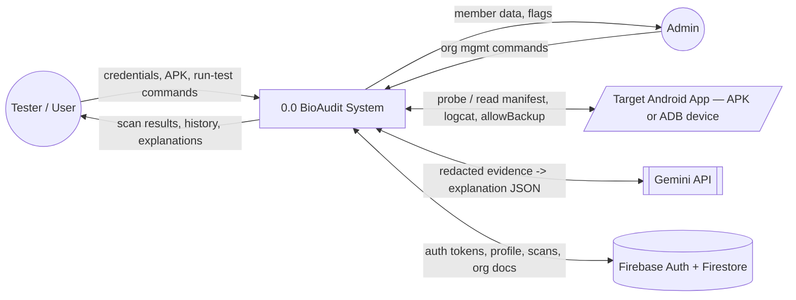
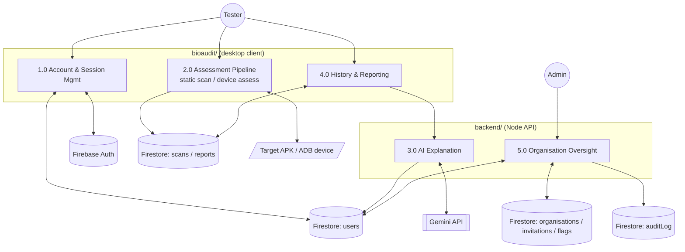
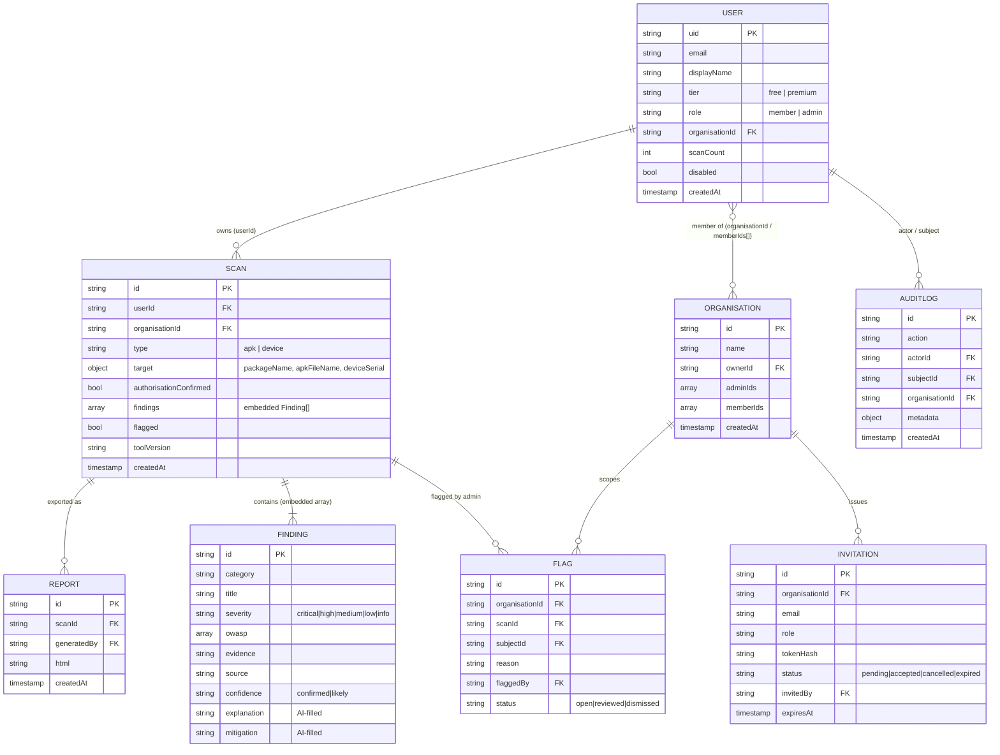
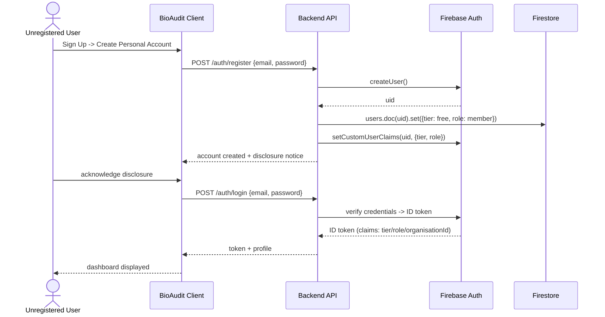
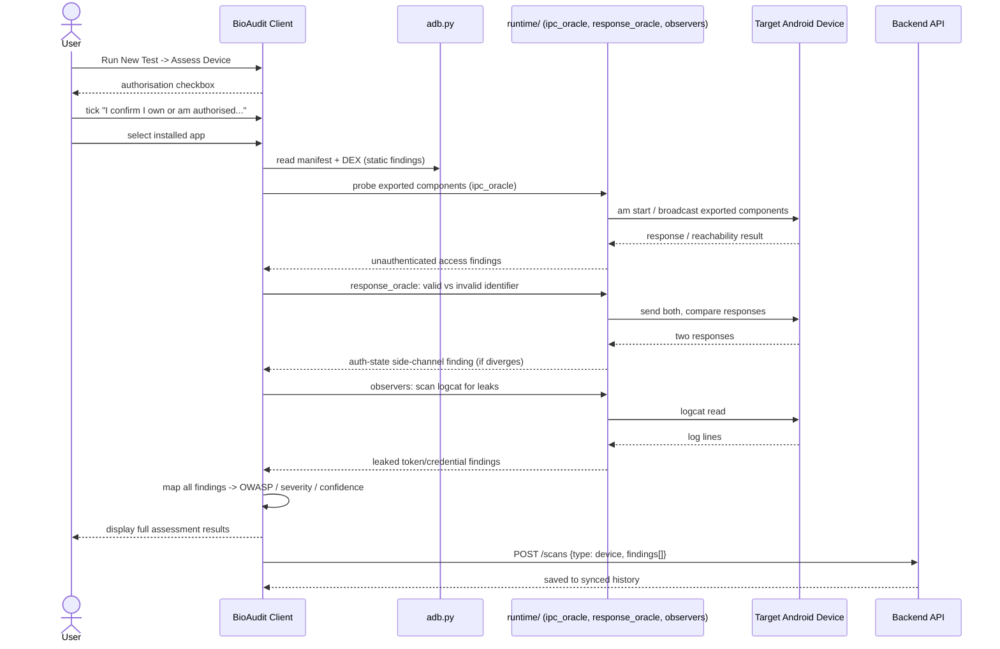
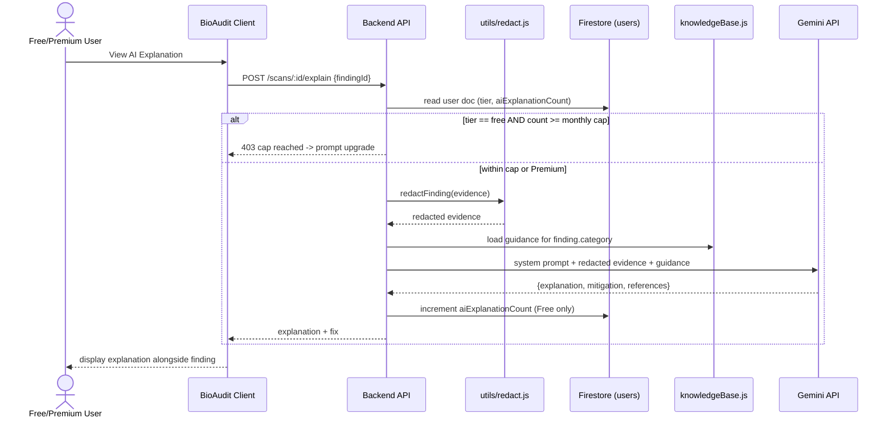
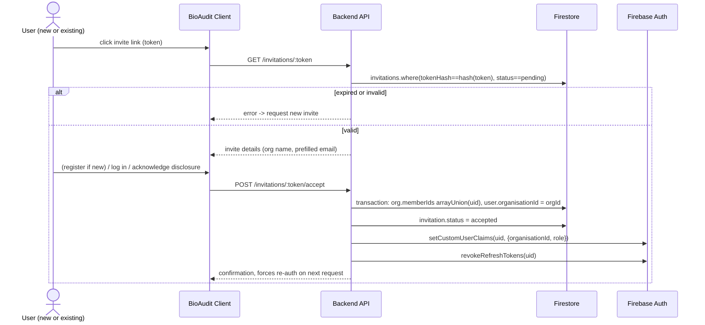
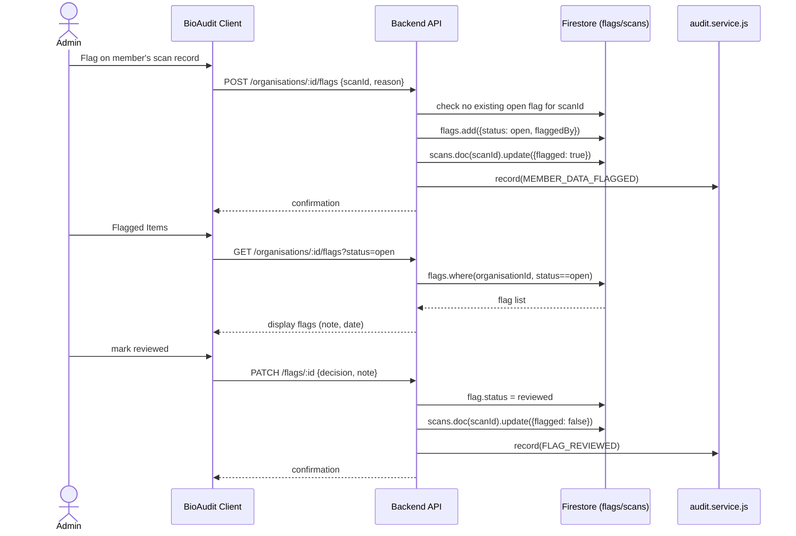

# Technical Design Manual — BioAudit

## 1. Introduction

Purpose: describe BioAudit's system design through Functional Hierarchy Diagram, Data Flow Diagrams, Entity Diagram, Sequence Diagrams. Wireframes and full field-level DB design out of scope this pass — diagrams only, sourced from URS (FYP-26-S3-14) and PRD, cross-checked against actual codebase (`bioaudit/models.py`, `backend/src/constants/index.js`, `backend/src/services/*.js`).

## 2. System Architecture Overview

Two independent codebases:
- **`bioaudit/`** (Python) — CLI, PySide6 GUI, Streamlit dashboard, scanning engine. Runs on tester's machine. Talks to Android device over ADB or reads APK file directly. Detection logic lives entirely here, deterministic, rule-based.
- **`backend/`** (Node/Express) — REST API. No scanning logic. Owns accounts, tier status, scan history, org oversight, AI explanation proxy. Deployed Cloud Run.

External dependents: **Firebase Authentication** (credentials, sessions, custom claims for tier/role/organisationId), **Cloud Firestore** (scan history, org data, invitations, flags, audit log), **Gemini API** (explanation generation only, never detection), **ADB/target Android device** (runtime probing, black-box, no root).

Key boundary: client does the scanning locally (device/APK are on tester's machine), backend only stores results and serves AI explanations. This is why `scans.service.js` says "the scanning itself happens in the desktop app."

## 3. Functional Hierarchy Diagram

```mermaid
flowchart TD
    ROOT[BioAudit]

    ROOT --> UNREG[Unregistered User]
    ROOT --> USR[User — Free/Premium shared]
    ROOT --> FREE[Free User]
    ROOT --> PREM[Premium User]
    ROOT --> ADM[Admin]

    UNREG --> UR1[Register User Account]
    UNREG --> UR2[Join Organisation via Invite]

    USR --> US1[Log In]
    USR --> US2[Log Out]
    USR --> US3[View Profile]
    US3 --> US3a[Update Account Details]
    US3 --> US3b[Change Email]
    US3 --> US3c[Change Password]
    USR --> US4[Delete Account]
    USR --> US5[Join Organisation]
    USR --> US6[Scan APK]
    USR --> US7[Assess Connected Device]
    USR --> US8[Delete Test History]

    FREE --> FR1[View AI Explanation — capped monthly]
    FREE --> FR2[View Test History — capped retention]
    FREE --> FR3[Upgrade to Premium]

    PREM --> PR1[View AI Explanation — uncapped]
    PREM --> PR2[View Test History — uncapped]
    PREM --> PR3[Compare Scan Results]
    PREM --> PR4[Export Scan Report]
    PREM --> PR5[Cancel Subscription]

    ADM --> AD1[Register Admin Account]
    ADM --> AD2[Log In / Log Out / Profile Mgmt]
    ADM --> AD3[Invite Member]
    ADM --> AD4[Cancel Pending Invitation]
    ADM --> AD5[View Member Data]
    AD5 --> AD5a[Remove Member from Organisation]
    AD5 --> AD5b[Delete Member Account]
    AD5 --> AD5c[Flag Data]
    ADM --> AD6[Review Flagged Data]
    ADM --> AD7[Add Admin]
```



Note: Admin branch holds no personal scanning capability — mirrors URS §2.3 ("Admin... has no personal detection or scanning capability").

## 4. Data Flow Diagrams

### 4.1 Context Diagram (Level 0)



### 4.2 Level 1 DFD



Process notes:
- 2.0 never writes to Firestore directly for the *finding content* logic — detection stays client-side and deterministic; only the finished `TestRun`/`Finding` payload is uploaded (US09/US10 post-conditions: "saved to the user's synced assessment history").
- 3.0 enforces tier cap (Free monthly limit) reading/writing `users` doc before calling Gemini — matches FR01 alt flow "Monthly cap reached."
- 5.0 writes every oversight action to `auditLog` (per `audit.service.js` — append-only, no client writes).

## 5. Entity Relationship Diagram

Grounded in `backend/src/constants/index.js` `COLLECTIONS` and the service files (`users.service.js`, `scans.service.js`, `organisations.service.js`). Firestore is document-based — relationships below are logical, not FK-enforced; array fields (`memberIds`, `adminIds`) implement the many-side.



## 6. Sequence Diagrams

Six flows chosen for architectural signal (auth, core detection pipeline, tier-gated AI, org oversight) — not all 30+ use cases.

### 6.1 Register + Login (UR01 / US01)



### 6.2 Scan APK (US09)

```mermaid
sequenceDiagram
    actor U as User
    participant GUI as BioAudit Client
    participant SA as static_analysis/
    participant API as Backend API
    participant FS as Firestore

    U->>GUI: Run New Test -> Scan APK
    U->>GUI: confirm authorisation
    U->>GUI: select APK file
    GUI->>SA: parse manifest + DEX identifiers
    SA-->>GUI: debuggable flag, boolean-only auth, allowBackup
    GUI->>GUI: map findings -> OWASP Mobile Top 10 (or "Uncategorised")
    GUI-->>U: display findings (severity, confidence, OWASP)
    GUI->>API: POST /scans {type: apk, findings[], authorisationConfirmed}
    API->>FS: scans.add(doc); enforceRetention(userId, tier)
    FS-->>API: saved
    API-->>GUI: scan id
```

### 6.3 Assess Connected Device (US10)



### 6.4 View AI Explanation with tier cap (FR01 / PR01)



### 6.5 Join Organisation via Invite (UR02 / US08)



### 6.6 Admin Flag + Review (AD13 / AD14)



## 7. Traceability

| Diagram | URS use cases covered |
|---|---|
| Functional Hierarchy | FEATURE-1..12 across all actor tiers (URS §2.2) |
| DFD Context / Level 1 | All — pipeline stages map to US06/US09/US10, FR01/PR01, AD-series |
| ERD | US03, US09, US10, US11, PR03, PR04, AD08–AD15 |
| Seq: Register + Login | UR01, US01 |
| Seq: Scan APK | US09 |
| Seq: Assess Device | US10 |
| Seq: AI Explanation | FR01, PR01 |
| Seq: Join Org | UR02, US08 |
| Seq: Flag + Review | AD13, AD14 |

Wireframes and full field-level DB schema deferred, not covered in this pass.
